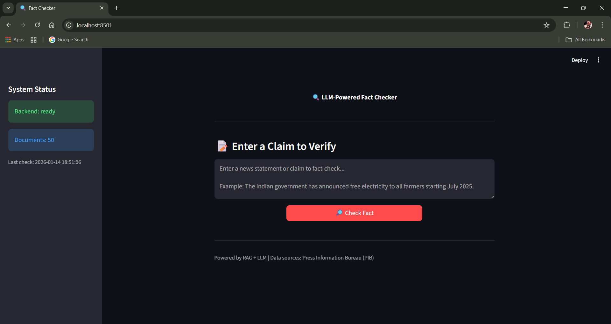

# LLM-Powered Fact Checker

A RAG-based fact-checking system that analyzes claims, extracts key statements, and verifies them against a vector database of verified government facts using LLM-powered comparison.

## 🎯 Features

- **Claim Detection**: Filters input using `Nithiwat/bert-base_claimbuster` to identify check-worthy statements
- **Claim Extraction**: Extracts key factual claims using `gemma:7b` via Ollama
- **Vector Retrieval**: Finds top-3 similar verified facts from ChromaDB
- **Fact Verification**: Compares claims with evidence using `deepseek-r1:7b` via Ollama
- **Structured Output**: Returns verdict (✅ True / ❌ False / 🤷 Unverifiable) with evidence and reasoning

## 🏗️ Architecture

```
User Input (Streamlit) 
    ↓
FastAPI Backend (/check endpoint)
    ↓
1. Claim Detection (ClaimBuster BERT)
    ↓
2. Claim Extraction (Ollama gemma:7b)
    ↓
3. Embedding (Qwen3-Embedding-0.6B)
    ↓
4. ChromaDB Retrieval (Top-3 facts)
    ↓
5. Fact Verification (Ollama deepseek-r1:7b)
    ↓
Structured JSON Output
```
---

## Here’s the preview:


---
## 🎥 **Walkthrough Video**

Watch the complete workflow in action:

[▶️ Watch Walkthrough Video](https://drive.google.com/file/d/1DYBQQx5abyv3yS7mDuSum8rxJlKMI6KY/view)

---
## 📦 Tech Stack

| Component | Technology |
|-----------|------------|
| Claim Detection | `Nithiwat/bert-base_claimbuster` (HuggingFace) |
| Claim Extraction | `gemma:7b` (Ollama) |
| Embeddings | `Qwen/Qwen3-Embedding-0.6B` (HuggingFace) |
| Vector Database | ChromaDB |
| Fact Verification | `deepseek-r1:7b` (Ollama) |
| Backend | FastAPI |
| Frontend | Streamlit |
| Package Manager | uv |

## 🚀 Quick Start

### Prerequisites

1. **Install uv** (if not already installed):
   ```bash
   pip install uv
   ```

2. **Install Ollama** and pull required models:
   ```bash
   ollama pull gemma:7b
   ollama pull deepseek-r1:7b
   ```

3. **Make sure Ollama is running**:
   ```bash
   ollama serve
   ```

### Installation

```bash
# Clone the repository
git clone <your-repo-url>
cd LLM-Powered-Fact-Checker

# Install dependencies
uv sync
```

### Running the Application

1. **Start the Backend** (includes data ingestion on startup):
   ```bash
   uv run main.py
   ```
   
   Wait for startup to complete (downloads models on first run).

2. **Start the Frontend** (in a new terminal):
   ```bash
   uv run streamlit run app.py
   ```

3. **Open the app**: Navigate to `http://localhost:8501`

## 📁 Project Structure

```
LLM-Powered-Fact-Checker/
├── artifacts/
│   ├── verified_facts.csv      # 50 verified government statements
│   └── chroma_db/              # ChromaDB vector store
├── src/fact_checker/
│   ├── __init__.py             # Logger import
│   ├── constants/              # Pydantic constants classes
│   ├── entity/                 # Return type definitions
│   ├── config/
│   │   ├── raw/config.yaml     # Configuration file
│   │   └── builder/            # Config builder classes
│   ├── components/
│   │   ├── data_ingestion.py   # CSV → Embeddings → ChromaDB
│   │   └── fact_checking.py    # Full RAG pipeline
│   ├── pipeline/
│   │   ├── data_ingestion.py   # Data ingestion pipeline
│   │   └── fact_checking.py    # Fact checking pipeline
│   ├── logger/                 # Logging configuration
│   ├── exception/              # Custom exceptions
│   └── utils/                  # Utility functions
├── main.py                     # FastAPI backend
├── app.py                      # Streamlit frontend
├── pyproject.toml              # Project configuration
└── README.md
```

## 🔌 API Endpoints

### Health Check
```bash
GET /health
```
Returns system status and document count.

### Fact Check
```bash
POST /check
Content-Type: application/json

{
  "claim": "The Indian government has announced free electricity to all farmers starting July 2025."
}
```

**Response:**
```json
{
  "original_input": "...",
  "claim": "...",
  "verdict": "False",
  "evidence": ["fact1", "fact2", "fact3"],
  "reasoning": "The retrieved evidence shows no official announcement...",
  "confidence_score": 0.85
}
```

## 📊 Sample Input/Output

**Input:**
> "The Indian government has announced free electricity to all farmers starting July 2025."

**Output:**
```json
{
  "verdict": "False",
  "evidence": [
    "Government has not announced free electricity to all farmers as of January 2026.",
    "PM-KISAN scheme has transferred Rs 3.24 lakh crore to over 11.8 crore eligible farmers.",
    "Pradhan Mantri Ujjwala Yojana has provided free LPG connections to over 10 crore households."
  ],
  "reasoning": "The claim about free electricity to all farmers starting July 2025 is not supported by official government announcements. The verified facts show various farmer welfare schemes but no specific announcement about universal free electricity."
}
```

## 🧪 Testing

```bash
# Test API endpoint
curl -X POST http://localhost:8000/check \
  -H "Content-Type: application/json" \
  -d '{"claim": "India became the 5th largest economy in 2022"}'
```

## 📝 License

MIT License
